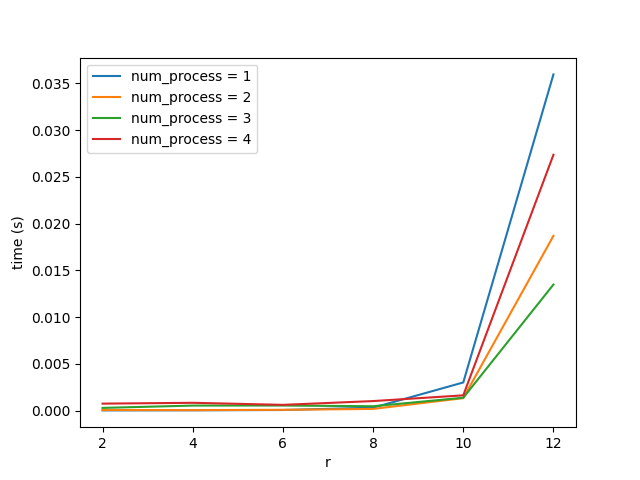

# Лабораторная работа 12

## Вариант 2

Пусть =a_0&plus;q_1(x)&plus;x^r&space;\cdot&space;q_2(x)&plus;x^{2r}&space;\cdot&space;q_3(x)&plus;...&plus;x^{(s-1)r}&space;\cdot&space;q_s(x)),
где  и 
=a_k&plus;...&plus;a_{k&plus;r-1}\cdot&space;x^r,&space;k&space;=&space;(i-1)r&space;&plus;&space;1)

Организовать процесс вычислений следующим образом:
1. Вычислить  (последовательно?).
2. Вычислить ,...,q_s(x)) (параллельно).
3. Вычислить r}) (последовательно?).
4. Вычислить сумму =a_0&plus;q_1(x)&plus;x^r&space;\cdot&space;q_2(x)&plus;x^{2r}&space;\cdot&space;q_3(x)&plus;...&plus;x^{(s-1)r}&space;\cdot&space;q_s(x)).

Для простоты считать s также степенью двойки. Распределить нагрузку
на процессоры с помощью цикличной слоистой схемы.

### Результат
Согласно заданию требуется распределить нагрузку между процессами с помощью
цикличной слоистой схемы, то есть, если число процессов равно p, то данные
с индексами 1, p + 1, 2p + 1 ... будут хранится на первом процессе, 
данные с индексами 2, p + 2, 2p + 2 ... будут хранится на втором процессе, 
и т.д.    

Для тестирования был написан скрипт `stress_test.py`, с помощью которого
бы построен график зависимости r от времени выполнения
программы при разном числе процессов. Результат представлен на рис.:

На рис. видно, что до некоторого значения r при разном числе процессов
время выполнения программы было мало, но с некоторого момента решение задачи с 
помощью нескольких процессов выполняется гораздо быстрее, чем при одном процессе.
